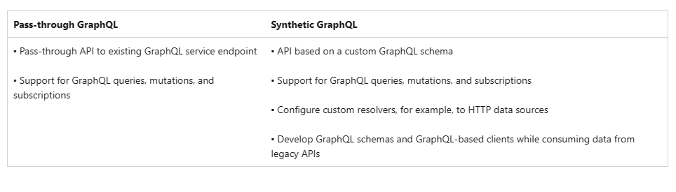
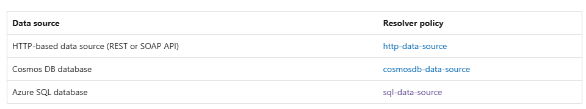

# Resources Regarding GraphQL APIs in Azure API Management

<https://learn.microsoft.com/en-us/azure/api-management/graphql-apis-overview>

You can use API Management to manage GraphQL APIs - APIs based on the GraphQL query language. GraphQL provides a complete and understandable description of the data in an API, giving clients the power to efficiently retrieve exactly the data they need. Learn more about GraphQL

API Management helps you import, manage, protect, test, publish, and monitor GraphQL APIs. You can choose one of two API models:

## Operation types

API Management supports the following operation types in GraphQL schemas. For more information about these operation types, see the GraphQL specification.

Query - Fetches data, similar to a GET operation in REST

Mutation - Modifies server-side data, similar to a PUT or PATCH operation in REST

Subscription - Enables notifying subscribed clients in real time about changes to data on the GraphQL service

For example, when data is modified via a GraphQL mutation, subscribed clients could be automatically notified about the change.

## Resolvers

Resolvers take care of mapping the GraphQL schema to backend data, producing the data for each field in an object type. The data source could be an API, a database, or another service. For example, a resolver function would be responsible for returning data for the users query in the preceding example.

In API Management, you can create a resolver to map a field in an object type to a backend data source. You configure resolvers for fields in synthetic GraphQL API schemas, but you can also configure them to override the default field resolvers used by pass-through GraphQL APIs.

API Management currently supports resolvers based on HTTP API, Cosmos DB, and Azure SQL data sources to return the data for fields in a GraphQL schema. Each resolver is configured using a tailored policy to connect to the data source and retrieve the data:

